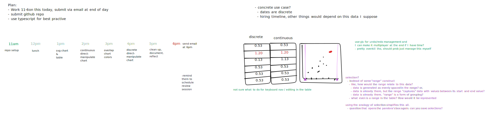
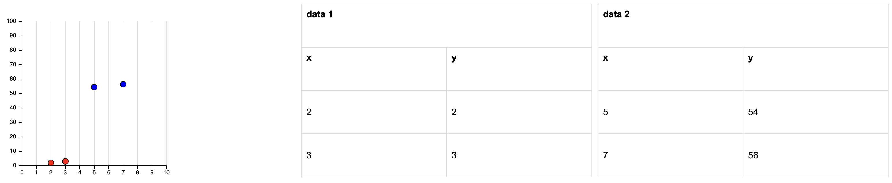
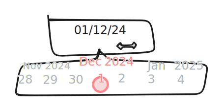

# Spindle Plot

This repo contains an exploration of mixed 2D plot and table interactions. It was produced as part of the interview process at Spindle.

## Try it out

[link to live demo](https://vezwork.github.io/spindle-plot/dist)

## Notes

### Planning

I spent 1 hour actively planning my execution of this project in the morning, and spent the rest of the day (6 hours) on the implementation.

Here is a picture of my plan that I created in TLDraw:

### Reflection on the outcome

I successfully implemented, from scratch:

- Direct manipulation of points in a plot, with continuous y-axis and discrete x-axis;
- Syncing plot point data with tabular data; and
- Syncing plot point hovering with tabular row highlighting.
- Justaposing two tables and plotting their data in two colors.

I did not get to the following features that I wanted to implement:

- **Highlighting and manipulation of multiple points at once**;
- Animating interpolation between jumps in value of points on a discrete axis;
- Ways to select points that are overlapping;
- Undo & redo;
- Editing data in the table;
- Hacky demo of collaboration;
- Keyboard controls;
- Including a more concrete use-case;
- Responsiveness;
- Accessibility;

All-in-all, I feel that what I produced for this project is a compromise between three things:

1. Complete control of the implementation (I did not use any libraries);
2. Implementation best practices; and
3. Design exploration.

The outcome is unfortunately only okay (not good) at showing off best practices and only okay (not good) at exploring the tangible interaction side of the design ideas we came up with together. I've had success in building things from scratch in other take-home projects, but in this one I don't feel that I properly managed the scope. In the future I would do two things during the kick-off meeting:

- Clarify at the start of the meeting what the project will be evaluated on. I only clarified this at the end of the meeting and was not expecting to be evaluated equally on the engineering and design exploration sides of the project.
- Based on what is clarified, narrow the scope of the project so that I feel I can properly balance expectations before the meeting ends.

### Design ideas coming from this exploration

#### Date Picker but with scrubbing

</img>
When you click and drag on a date value, a "scrubber" would pop up beside the value,
allowing you to quickly scrub to the date you want using only a single click, drag, and release. This idea is an adaptation of the number value scrubbing interaction from applications like Figma.

#### Plot point interpolation should use dynamics, not easing functions

I briefly experimented with animating between value jumps of points on the discrete axis of the plot. I should have taken a video or committed this very small exploration. I did not expect to not have time to come back to it.

During this brief experiment I realized that in order to make it so that an animation does not awkwardly reset
when you move a point while it is still interpolating to another place, you must specify the interpolation using an differential equation (with something like position affected by speed and/or acceleration), not an easing function (like one of these https://easings.net).

#### Selection is a good analogy for manipulating multiple values at once

During the meeting we discussed having a range that multiple values fall inside of (e.g. hiring season start and end dates and individual hire dates fall within that range). I wasn't sure how to think about this in a way that supports tabular display and interaction and plot display and interaction. In my planning, I realized that thinking of this range as a selection of multiple values simplifes the idea and makes the interaction design straightforward (click and drag to select). I like this idea because selections are easy, fast, and versatile.

## Local Dev Instructions

1. Clone this repo
2. Open the folder you cloned in your console
3. Run `npm install`
4. Run `npm run watch`
5. Navigate to `localhost:8080/dist` in your browser. If you make changes to files, the server will serve the changed files, but you'll have to refresh the page in your browser (sometimes hard refresh).

### References and Sources:

- package.json, tsconfig, and .gitignore copied from vezwork/polylab
